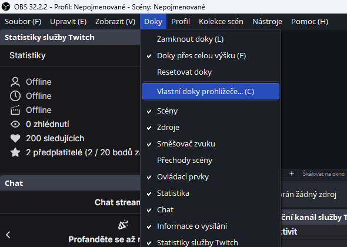
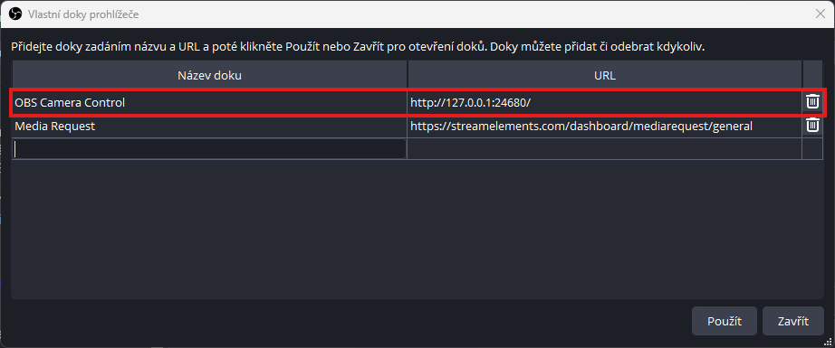

# OBS Camera Dock — větev Windows

**Stav vydání 0.4.3:** základní ovládání **Razer Kiyo V2 X ve Windows je funkční a ověřené uživatelem**. Logitech C920, ostatní UVC kamery a automatické funkce podle obličeje (expozice, ostření, tracking) jsou experimentální a vyžadují další doladění.

Větev `windows` přidává **Windows 10/11 x64 helper (0.4.3 preview)**, výběr Razer Kiyo, Logitech C920 a dalších UVC kamer, stejné webové rozhraní a presety oddělené podle kamery. Nově nabízí [funkce podle obličeje](Windows/FACE-FEATURES.md): expozici, ostření a digitální trackování v OBS.

**[Návod pro Windows, sestavení a stav testování →](Windows/README.md)**

```powershell
powershell -ExecutionPolicy Bypass -File .\scripts\build-windows.ps1
```

Spusťte `dist\windows\OBS Camera Dock.exe` a v OBS přidejte Custom Browser Dock s URL `http://127.0.0.1:24680/`. Základní Windows ovládání uživatel ověřil. Nové funkce podle obličeje používají lokální OBS WebSocket; stav testování je v návodu.

---

## Instalace skriptem

Stáhněte a rozbalte [instalační ZIP](https://github.com/realroyalcrown/OBS-Camera-Dock/releases/download/v0.4.3-windows-preview/OBS-Camera-Dock-Windows-0.4.3-install.zip), poté spusťte **install.cmd**. PowerShell skript najde OBS Studio nebo umožní vybrat jeho kořenovou složku. Do `obs-camera-dock` umístí EXE a uklidí pouze starý obsah této podsložky. OBS a uživatelské presety zachová.

## Přidání doku do OBS

1. Spusťte OBS Camera Dock a v OBS otevřete **Doky → Vlastní doky prohlížeče…**.



2. Zadejte název **OBS Camera Control** a URL **http://127.0.0.1:24680/**. Klikněte na **Použít** nebo **Zavřít**.



## Snímky aplikace

| Expozice | Výběr kamery |
| --- | --- |
|  |  |

| Obraz | Optika |
| --- | --- |
|  |  |

### Experimentální funkce podle obličeje


### Nabídka v systémové liště


