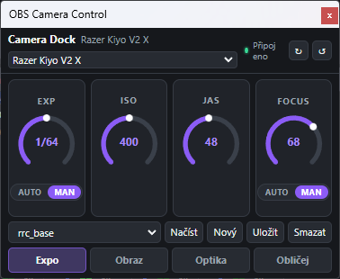
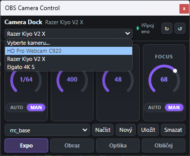
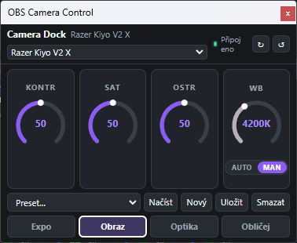
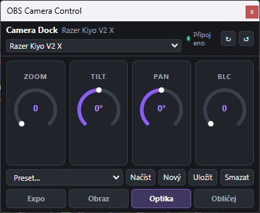
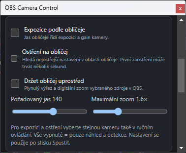
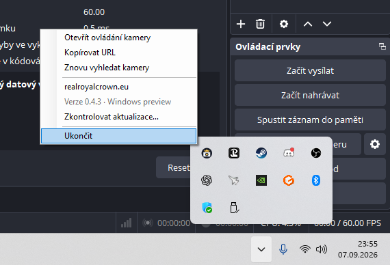

# OBS Camera Dock — větev Windows

**Stav vydání 0.4.3:** základní ovládání **Razer Kiyo V2 X ve Windows je funkční a ověřené uživatelem**. Logitech C920, ostatní UVC kamery a automatické funkce podle obličeje (expozice, ostření, tracking) jsou experimentální a vyžadují další doladění.

Větev `windows` přidává **Windows 10/11 x64 helper (0.4.3 preview)**, výběr Razer Kiyo, Logitech C920 a dalších UVC kamer, stejné webové rozhraní a presety oddělené podle kamery. Nově nabízí [funkce podle obličeje](Windows/FACE-FEATURES.md): expozici, ostření a digitální trackování v OBS.

**[Návod pro Windows, sestavení a stav testování →](Windows/README.md)**

```powershell
powershell -ExecutionPolicy Bypass -File .\scripts\build-windows.ps1
```

Spusťte `dist\windows\OBS Camera Dock.exe` a v OBS přidejte Custom Browser Dock s URL `http://127.0.0.1:24680/`. Základní Windows ovládání uživatel ověřil. Nové funkce podle obličeje používají lokální OBS WebSocket; stav testování je v návodu.

---

## Instalace skriptem

Stáhněte a rozbalte [instalační ZIP](https://github.com/realroyalcrown/OBS-Camera-Dock/releases/download/v0.4.3-windows-preview/OBS-Camera-Dock-Windows-0.4.3-install.zip), poté spusťte **install.cmd**. PowerShell skript najde OBS Studio nebo umožní vybrat jeho kořenovou složku. Do `obs-camera-dock` umístí EXE a uklidí pouze starý obsah této podsložky. OBS a uživatelské presety zachová.

## Snímky aplikace

| Expozice | Výběr kamery |
| --- | --- |
|  |  |

| Obraz | Optika |
| --- | --- |
|  |  |

### Experimentální funkce podle obličeje



### Nabídka v systémové liště



# Původní verze pro macOS

Lokální ovládací dok pro USB UVC kamery (primárně **Razer Kiyo V2 X**) v OBS Studio. Projekt neobsahuje OBS plugin — běží jako samostatná menu-bar aplikace, která vystavuje ovládací stránku přes lokální HTTP server a komunikuje s kamerou přes UVC vrstvu odvozenou z [CameraController](https://github.com/itaybre/CameraController).

**Verze:** 0.2.2 · **macOS:** 14+ · **Síť:** pouze `127.0.0.1` (bez internetu)

---

## Co projekt dělá

| Vrstva | Popis |
|--------|--------|
| **OBS Camera Dock Helper.app** | Menu-bar proces na macOS. Vyhledá kameru, drží UVC spojení, servíruje UI. |
| **Lokální HTTP server** | `http://127.0.0.1:24680/` — statická stránka + REST JSON API. |
| **OBS Custom Browser Dock** | V OBS načte stejnou URL; UI běží uvnitř doku. |
| **UVCControls** | Swift knihovna pro USB Video Class ovladače (fork CameraController). |

Helper **neotevírá video stream**. OBS může kameru používat paralelně.

---

## Rychlý start

1. Spusťte `dist/OBS Camera Dock Helper.app` (nebo sestavte viz níže).
2. V OBS: **Docks → Custom Browser Docks…**
3. Název: `Camera`, URL: `http://127.0.0.1:24680/`
4. Helper musí běžet po celou dobu používání doku.

Z ikony kamery v menu liště lze otevřít UI v prohlížeči, zkopírovat URL nebo znovu vyhledat kameru.

---

## Ovládací panely

UI je rozdělené do tří záložek s kruhovými ovladači:

| Panel | Ovladače |
|-------|----------|
| **Expo** | Expozice (AUTO/MAN, čas), Gain/ISO, jas, focus (AUTO/MAN) |
| **Obraz** | Kontrast, saturace, ostrost, white balance (AUTO/MAN) |
| **Optika** | Zoom, tilt, pan, backlight — zobrazeno jen pokud kamera podporuje |

Zobrazují se **pouze ovladače**, které firmware kamery skutečně hlásí jako schopné (`isCapable`).

### Focus

Vyšší hodnota = ostření **blíž** (near). Nižší = **dál** (far). Chování je invertované oproti surové UVC škále, aby odpovídalo intuitivnímu ovládání.

### Presety

Presety se ukládají do:

```
~/Library/Application Support/OBS Camera Dock/presets.json
```

Každý panel má vlastní seznam presetů (Expo / Obraz / Optika). Načtení presetu podle ID funguje napříč panely.

#### Výchozí preset `rrc_base`

Při prvním připojení kamery se vytvoří (nebo aktualizuje) tovární preset **`rrc_base`**, který se **automaticky aplikuje jednou** po startu helperu, jakmile je kamera online:

| Parametr | Hodnota |
|----------|---------|
| Expozice | MAN, 1/60 s |
| Gain / ISO | 400 |
| Jas | 48 |
| Focus | MAN, 68 |
| White balance | MAN, 4200 K |

Preset je viditelný v dropdownu na panelu **Expo**; obsahuje i nastavení WB z panelu Obraz.

---

## HTTP API

Server naslouchá **výhradně** na `127.0.0.1:24680`. Žádné webhooky, cloud ani externí integrace neexistují.

| Metoda | Cesta | Popis |
|--------|-------|--------|
| `GET` | `/` | Ovládací stránka (`index.html`) |
| `GET` | `/api/state` | Stav kamery, ovladače a presetů (JSON) |
| `POST` | `/api/control` | Změna jednoho ovladače — tělo: `{"id":"gain","value":123}` nebo `{"id":"focusAuto","enabled":false}` |
| `POST` | `/api/rescan` | Znovu vyhledat kameru |
| `POST` | `/api/reset` | Vrátit UVC ovladače na výchozí hodnoty |
| `POST` | `/api/presets/create` | `{"panel":"expo","name":"Můj preset"}` — uloží aktuální hodnoty panelu |
| `POST` | `/api/presets/save` | `{"panel":"expo","id":"<uuid>"}` — přepíše preset |
| `POST` | `/api/presets/load` | `{"panel":"expo","id":"<uuid>"}` — načte preset (ID hledá ve všech panelech) |
| `POST` | `/api/presets/delete` | `{"panel":"expo","id":"<uuid>"}` |

Odpovědi jsou JSON. Chyby: HTTP 400/404/500 s `{"error":"…"}`. CORS hlavičky jsou povoleny pro lokální volání z OBS browser doku.

### Příklad stavu

```json
{
  "connected": true,
  "cameraName": "Razer Kiyo V2 X",
  "message": "Připojeno",
  "controls": [
    {
      "id": "gain",
      "label": "Gain / ISO",
      "kind": "slider",
      "value": 42,
      "minimum": 0,
      "maximum": 255,
      "step": 1,
      "unit": null,
      "dependsOn": null
    }
  ],
  "presets": {
    "expo": { "items": [...], "selectedId": "rrc_base" },
    "obraz": { "items": [], "selectedId": null },
    "optika": { "items": [], "selectedId": null },
    "startupPresetId": "rrc_base"
  }
}
```

---

## Struktura projektu

```
OBS-Camera-Dock-Source/
├── Package.swift                 # SwiftPM — jediná závislost: systémové frameworky
├── scripts/
│   ├── build-app.sh              # Sestavení .app bundle
│   └── Info.plist                # Metadata aplikace
├── Sources/
│   ├── CameraDockHelper/         # Menu-bar app + HTTP + UI
│   │   ├── AppMain.swift         # Vstupní bod, menu lišta, USB hotplug
│   │   ├── HTTPServer.swift      # Minimální HTTP/1.1 server (Network.framework)
│   │   ├── APIController.swift   # Směrování API požadavků
│   │   ├── CameraService.swift   # UVC logika, mapování ovladačů, rrc_base
│   │   ├── PresetStore.swift     # Persistence presetů
│   │   ├── USBDiagnostics.swift  # CLI: --diagnose-usb
│   │   └── Resources/index.html  # Celé UI (HTML/CSS/JS, bez build kroku)
│   ├── UVCControls/              # UVC knihovna (CameraController fork)
│   └── UVCHeaders/               # C hlavičky pro IOKit/USB
├── dist/                         # Výstup buildu (gitignored)
└── README.md
```

---

## Sestavení

Vyžaduje **Xcode Command Line Tools** (Swift 6 toolchain). Žádný npm, CocoaPods, Carthage ani jiný package manager.

```sh
./scripts/build-app.sh
```

Výsledek: `dist/OBS Camera Dock Helper.app`

---

## CLI režimy

Spustitelný soubor uvnitř `.app` (`Contents/MacOS/CameraDockHelper`) nebo binárka ze `swift build`:

| Argument | Popis |
|----------|--------|
| *(žádný)* | Normální menu-bar aplikace |
| `--headless` | Pouze HTTP server bez UI menu lišty |
| `--diagnose` | Vypíše JSON stav kamery a ukončí se |
| `--diagnose-usb` | Vypíše UVC capability flags pro Razer Kiyo (VID 0x1532, PID 0x0E0C) |

---

## Závislosti a co se nepoužívá

### Používá se

- **Swift / SwiftPM** — build i runtime
- **AppKit** — menu-bar aplikace
- **AVFoundation** — discovery USB kamer
- **IOKit / USB** — UVC control requesty
- **Network.framework** — TCP HTTP server
- **Foundation** — JSON, persistence

### Nepoužívá se (žádné integrace navíc)

- Webhooky, WebSocket, MQTT, cloud sync
- npm / node_modules, frontend frameworky
- OBS plugin SDK — dok je čistě browser dock přes URL
- Externí síť — kromě localhost

### UVC ovladače v knihovně, ale ne v UI

Fork `UVCControls` inicializuje i ovladače, které UI neexponuje (např. `scanningMode`, `irisAbsolute`, `rollAbsolute`, `hue`, `gamma`, `powerLineFrequency`, `contrastAuto`). Jsou součástí původní CameraController knihovny; aplikace je záměrně nezobrazuje, dokud nejsou potřeba.

---

## Poznámky k provozu

- UVC standard používá **gain** místo fotografického ISO; UI zobrazuje ekvivalentní ISO hodnoty odvozené logaritmicky z rozsahu gainu.
- Rozsah a krok ovladačů určuje firmware kamery.
- Pokud současně běží **CameraController** nebo jiná UVC aplikace, může docházet k přepisování hodnot — ukončete ji.
- Při aktualizaci nejdřív ukončete helper z menu lišty, potom nahraďte `.app`.
- Tovární preset `rrc_base` se při startu helperu **aktualizuje na výchozí hodnoty** definované v kódu (uživatelské úpravy tohoto konkrétního presetu se tím přepíší).

---

## Historie verzí

### 0.2.2

- Ovládací panely Expo / Obraz / Optika s kruhovými ovladači
- Presety s persistencí, výchozí `rrc_base` s auto-aplikací při startu
- Invertovaný focus (vyšší = blíž), invertovaný barevný přechod WB
- Pan, tilt, backlight (pokud kamera podporuje)

### 0.2.1

- Kompaktní UI pro OBS dock cca 450×320

### 0.1.1

- Opravy USB descriptorů Razer Kiyo V2 X, fallback UVC na novějším macOS

Úplný changelog: [`CHANGELOG.md`](CHANGELOG.md)

---

## Licence a původ

Projekt je licencován pod **GNU GPL v3**, protože obsahuje upravené části UVC implementace z [Itaybre/CameraController](https://github.com/itaybre/CameraController), Copyright © Itay Brenner / Itaysoft. Úplné znění: [`LICENSE`](LICENSE).
